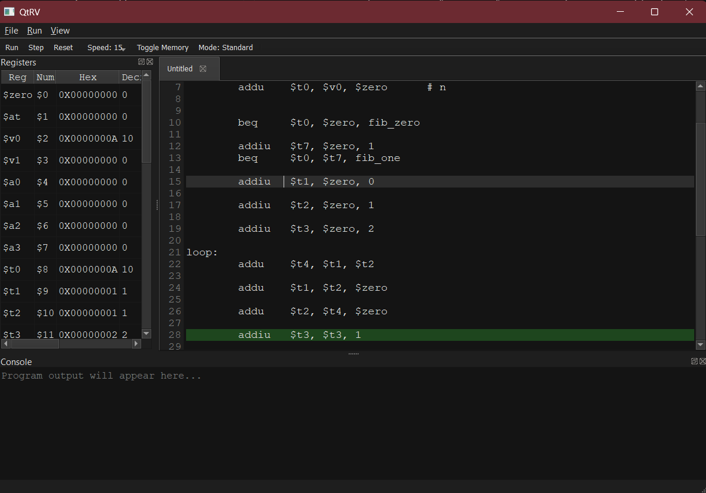
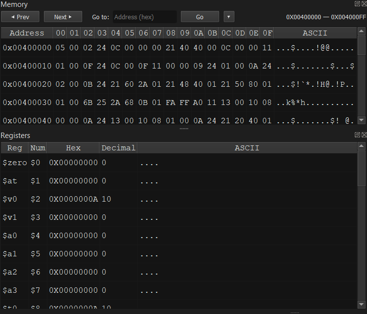
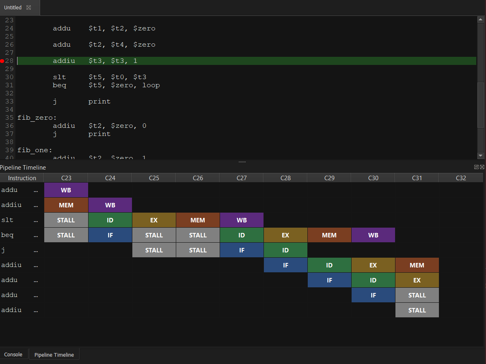

# QtRV — MIPS Assembly IDE & Pipelined CPU Simulator

QtRV is a desktop IDE for writing, assembling, and executing MIPS assembly programs, built with C++17 and Qt5. It includes a from-scratch lexer, parser, assembler, and CPU core, and supports both a single-cycle execution mode and a 5-stage pipelined execution mode with hazard detection, stalls, and flushes — visualized live as the program runs.

## Screenshots


**Main editor & layout**



**Register & memory panels**



**Pipeline visualization (5-stage pipeline mode)**




## Features

- **Code editor** with tabbed multi-file editing, syntax-aware line handling, and modification tracking (new/open/save/save-as, close-with-unsaved-changes prompt).
- **Assembler pipeline**: hand-written `Lexer → Parser → IR → Assembler` translates MIPS assembly source into machine code, with a PC-to-source-line map for debugging.
- **Two execution modes**:
  - *Standard mode*: single-cycle instruction execution (`tick()`).
  - *Pipeline mode*: 5-stage pipeline (`cycleTick()`) with IF_ID / ID_EX / EX_MEM / MEM_WB latches, stalling, and branch-flush handling.
- **Pipeline visualization panel**: renders each in-flight instruction's stage history (IF, ID, EX, MEM, WB, STALL, FLUSH) per cycle in a live table.
- **Register & memory panels**: real-time inspection of all 32 general-purpose registers, HI/LO, PC, and program memory.
- **Breakpoints & stepping**: set breakpoints by source line, single-step (F10), or run to completion/breakpoint (F5).
- **Adjustable execution speed**: slider-controlled run speed from 1 IPS/Hz up to realtime/max.
- **Console I/O**: supports MIPS syscalls for print/read (integers and strings) via an interactive input dialog.
- **Dark theme UI** via a custom Qt `Fusion`-style palette.

## Architecture

```
core/                   Core emulation library (no Qt dependency)
  include/
    Lexer.h / Tokens.h   Tokenizes raw MIPS assembly source
    Parser.h / IR.h      Builds an intermediate representation from tokens
    Assembler.h          Encodes IR into MIPS machine code (Binary)
    MipsCPU.h            CPU state, registers, single-cycle + pipelined execution
    Emulator.h           Orchestrates load/run/step and pipeline-history tracking
    Memory.h / Loader.h  Flat memory model and program loading
  src/                   Implementations of the above

gui/                    Qt5 widgets application
  src/
    MainWindow           Menus, toolbar, docks, run/step/reset wiring
    CodeEditor           Tabbed source editor
    RegisterPanel        Live register file view
    MemoryPanel          Live memory view
    PipelinePanel         Per-cycle pipeline stage visualization
    Console              Program stdin/stdout

tests/                  Sample MIPS programs (e.g. Sieve of Eratosthenes) used for manual testing
```

The `core` library is fully decoupled from Qt, so the emulator/assembler can be reused or unit-tested independently of the GUI.

## Building

**Requirements**: CMake 3.15+, a C++17 compiler, Qt5 (Widgets), and [vcpkg](https://github.com/microsoft/vcpkg) for dependency resolution (see `CMakePresets.json`).

```bash
cmake --preset default
cmake --build build --config Release
```

Or use the provided presets directly:

```bash
cmake --preset prod
cmake --build --preset prod-build
```

Run the resulting `QTRv` executable from the build output directory.

## Usage

1. Launch QtRV and write or open a `.asm` MIPS assembly file (see `tests/add_print.asm` for an example).
2. Press **F5** (Assemble & Run) to assemble and execute, or **F10** to single-step.
3. Toggle **Mode: Pipeline** on the toolbar to switch from single-cycle to the 5-stage pipelined CPU and watch the pipeline panel populate cycle-by-cycle.
4. Use the **View** menu to show/hide the Register, Memory, Console, and Pipeline docks.
5. Set breakpoints on a line and run — execution will pause when hit, and you can step or resume from there.

## Status

Actively developed as a learning/portfolio project. Contributions, issue reports, and feedback are welcome.
